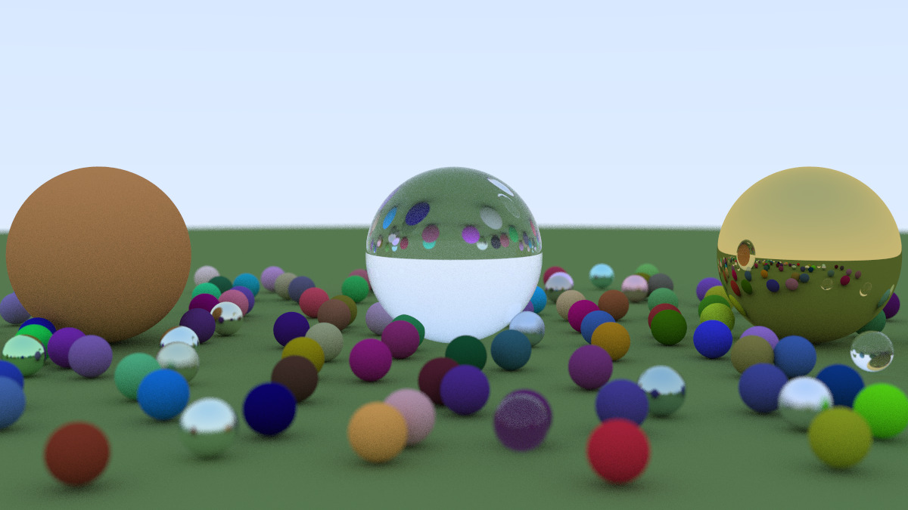
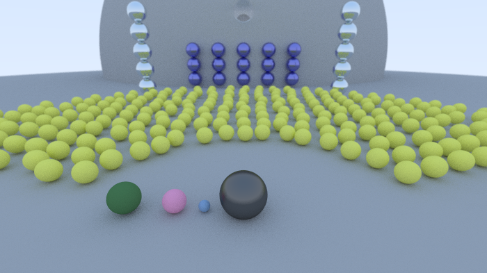
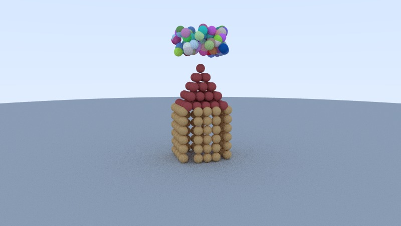
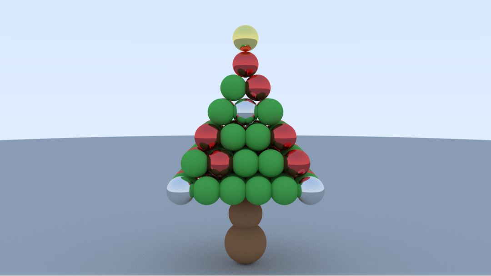

# Projeto de Ray Tracing - RTWeekend

> Um projeto visual inspirado no livro *"Ray Tracing in One Weekend"*, com cenas personalizadas baseadas em personagens, plateias, objetos e materiais diversos.

---

## Membros do Grupo

- Caroline Ito Gutierrez - 821689
- Renan Suana Grothe Garcia 822469
- Pedro Henrique Pereira Machado 828632
- Enrico Augusto Pagani da Silva 822888

---

## Cenas Criadas


### Cena 1



> Cena com três esferas principais: uma difusa marrom, uma de vidro translúcido e uma metálica dourada, cercadas por várias esferas pequenas coloridas de diferentes materiais, sobre um chão verde e sob um céu claro.

---

### Cena 2



> Cena representando quatro personagens em destaque na frente, rodeados por uma plateia de esferas amarelas. Ao fundo, colunas decorativas e uma estrutura curva completam o cenário.

### Cena 3



> Cena com uma casa feita de bolinhas, rodeada de "balões" em cima dela 🏠🎈🎈🎈.

### Cena 4



> Um simples árvore de natal enfeitada com decorações reluzentes.

---

## Como Rodar o Projeto

### Pré-requisitos

- Compilador C++ com suporte a C++11 ou superior
- Biblioteca padrão C++ (nenhuma dependência externa é usada)

### 📦 Compilando e Executando

```bash
# Clone o repositório
git clone https://github.com/seu-usuario/nome-do-repositorio.git
cd nome-do-repositorio

# Vá para a branch da cena que deseja executar 
git checkout (cena_1, cena_2, cena_3 ou cena_4)

# Vá para o diretório do código
cd .\src\InOneWeekend\

# Compile
g++ -std=c++17 main.cc -o renderer

# Gere a imagem 
./renderer > image.ppm
